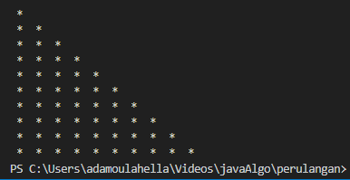

# Tugas 1 - Percabangan
Buatlah program dengan python untuk menerima masukan berupa jam lembur, jika jam lembur kurang dari 12 jam maka akan menampilkan gaji lembur sebesar Rp. 100.000, jika jam lembur sama dengan 12 jam maka akan menampilkan gaji lembur sebesar Rp. 200.000, dan jika lebih dari 12 jam maka gaji lembur sama dengan Rp. 300.000

# Tugas 2 - Perulangan
Buatlah program python dengan mengimplementasikan metode perulangan untuk mencetak pola bintang seperti gambar dibawah ini
